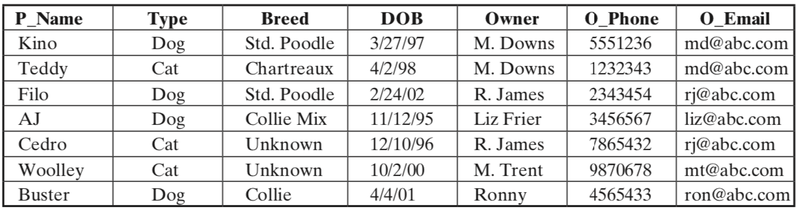
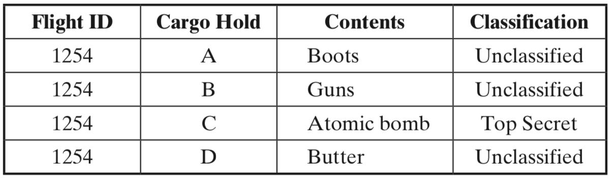

# CECS 378 Reading Assignment: Database and Cloud

### Assignment Description
Answer the following questions from the Chapter 5 reading from your text book. Be complete with your answers. You may work on these questions with one or two other partners, but *all* students must submit the document individually in their own repositories along with each student's name documented with the submission.

1. Explain the concept of *cascading authorizations*.

2. What are the disadvantages to database encryption?

3. Consider a simplified university database that includes information on courses (name, number, day, time, room number, max enrollment) and on faculty teaching courses and students attending courses. Suggest a relational database for efficiently managing this information and explain why you chose that one.

4. The following table shows a list of pets and their owners that is used by a veterinarian
service.
	
  
   1. Describe four problems that are likely to occur when using this table.
   2. Break the table into two tables in a way that fixes the four problems.

1. Consider an SQL statement:

    ``` sql
    `\code{SELECT id,forename,surname FROM authors WHERE forename='john' AND surname='smith'}`
    ```
    
    1. What is this statement intended to do?
    2. Assume that the forename and surname fields are being gathered from user-supplied input, and suppose the user responds with:

        ``` sql
        Forename: jo'hn
        Surname: smith
        ```

           What will be the effect?
    
    3. Now suppose the user responds with:
 
        ``` sql
        Forename: jo'; drop table authors--
        Surname: smith
        ```
       
           What will be the effect?


6. The following shows a fragment of code that implements the login functionality for a database application. The code dynamically builds an SQL query and submits it to a database.

    ``` sql
    String login, password, pin, query
    login = getParameter("login");
    password = getParameter("pass");
    pin = getParameter("pin");
    Connection conn.createConnection("MyDataBase");
    query = "SELECT accounts FROM users WHERE login='" +
        login + "'AND pass='" + password +
        "'AND pin=" + pin;
    ResultSet result = conn.executeQuery(query);
    if (result!=NULL)
        displayAccounts(result);
    else
        displayAuthFailed();
    ```

    1. Suppose a user submits login, password, and pin as *doe*, *secret*, and *123*. Show the SQL query that is generated.
 
    2. Instead, the user submits for the login field the following: {' or 1 = 1 - -}. What is the effect?

7. Consider the parts department of a plumbing contractor. The department maintains an inventory database that includes parts information (part number, description, color, size, number in stock, etc.) and information on vendors from whom parts are obtained (name, address, pending purchase orders, closed purchase orders, etc.). In an RBAC system, suppose that roles are defined for accounts payable clerk, an installation foreman, and a receiving clerk. For each role, indicate which items should be accessible for read-only and read-write access.

8. Imagine that you are the database administrator for a military transportation system. You have a table named cargo in your database that contains information on the various cargo holds available on each outbound airplane. Each row in the table represents a single shipment and lists the contents of that shipment and the flight identification number. Only one shipment per hold is allowed. The flight identification number may be cross-referenced with other tables to determine the origin, destination, flight time, and similar data. The cargo table appears as follows:
   

  


Suppose that two roles are defined: *Role 1* has full access rights to the cargo table. *Role 2* has full access rights only to rows of the table in which the Classification field has the value Unclassified. Describe a scenario in which a user assigned to *role 2* uses one or more queries to determine that there is a classified shipment on board the aircraft.

   1. Users *luke* and *leih* do not have the SELECT access right to the Inventory table and the Item table. These tables were created by and are owned by user *palpatine*. Write the SQL commands that would enable *palpatine* to grant *SELECT* access to these tables to *luke* and *leih*.

   2.  Consider a database table that includes a salary attribute. Suppose the three queries *sum*, *count*, and *max* (in that order) are made on the salary attribute, all conditioned on the same predicate involving other attributes. That is, a specific subset of records is selected and the three queries are performed on that subset. Suppose that the first two queries are answered and the third query is denied. Is any information leaked?

## Deliverables

Commit the answers to the questions in a readable file to your git repository by the due date and time indicated with your repository on GitHub Classroom. The only approved file submission format is Markdown. Other formats will only be accepted with explicit approval.

### Please note:

* Your writeup file *must* be done in [Markdown](https://docs.github.com/en/get-started/writing-on-github/getting-started-with-writing-and-formatting-on-github/basic-writing-and-formatting-syntax) format and must be included in the repository as a separate file. View the file [`README.md`](README.md?plain=1) for an example of Markdown.
* Any included images or screenshots should be done in `*.jpg`, `*.png`, or `*.gif` formats, and be included individually as files in your repository (i.e. no binary ‘document’ with the images pasted inside).
* Screenshots or images *may* be linked in your Markdown file writeup if you wish to do so.